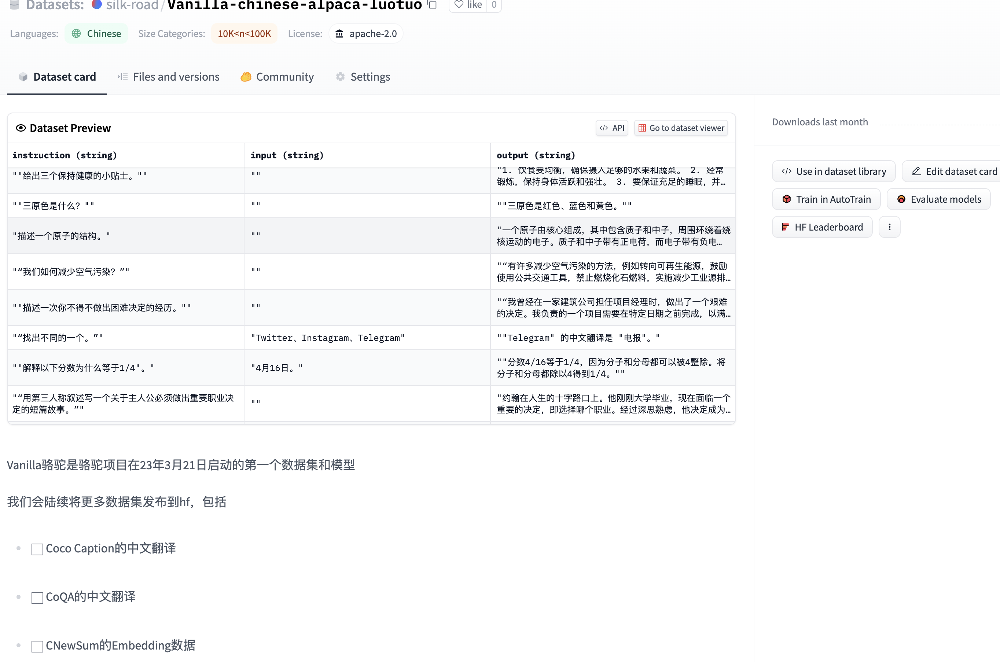

# 【骆驼读论文】HuggingFace社区上 29个中文数据集的整理

随着[骆驼项目](https://github.com/LC1332/Luotuo-Chinese-LLM)的整体进展，尽管大家都是在佛系干活，

但是我们项目中涉及的数据集仍然越来越多。

我最近正好在整理批量翻译的代码。打算把MSRA的WizardLM的指令翻译了做个中文数据集。

翻译的途中突然想到，可以看一看HuggingFace社区上有什么中文数据集。

本文档涉及29个中文数据集，我基本只看了10k条以上规模的数据集，因为更小的真的对于LLM的训练不一定有很强的效果。如果你觉得我们的工作对你有用，欢迎到我们 [骆驼项目的主页](https://github.com/LC1332/Luotuo-Chinese-LLM) 去点上star，谢谢。

---

首先是我们昨天自己上传的数据集

[https://huggingface.co/datasets/silk-road/Vanilla-chinese-alpaca-luotuo](https://huggingface.co/datasets/silk-road/Vanilla-chinese-alpaca-luotuo)

这是我们在3月21日启动骆驼整体项目的时候，构造的第一个数据集

里面由于翻译prompt的缺陷，有非常多可见的噪音。新的翻译脚本已经可以修正这个问题，如果等我们WizardLM翻译好大家可以看看新脚本的效果。

下面开始数据集的整理

我搜了一下，HuggingFace上面涉及Chinese的数据集只有287个，基本上都看看，应该就不容易漏了吧

 

    

https://huggingface.co/datasets/silk-road/Vanilla-chinese-alpaca-luotuo

不才，正式在下。。

这个是我们在骆驼项目的第一批数据 噪音还是挺多的。我最近升级了翻译脚本，我们后期的数据集翻译的准确率会提升很多。

https://huggingface.co/datasets/shibing624/alpaca-zh

这个作者声称是5万GPT4要来的数据。

https://huggingface.co/datasets/QingyiSi/Alpaca-CoT

这个是中科院同学整理的数据集合集
这里面是中英文混杂的 要好好找一下哪些是中文的

https://huggingface.co/datasets/c-s-ale/alpaca-gpt4-data-zh

这个感觉和我们的好像。。我看了这个比第二个的噪音多

https://huggingface.co/datasets/Chinese-Vicuna/guanaco_belle_merge_v1.0

这个合并了Guanaco和Belle的数据集

 

这个有6M条

 
https://huggingface.co/datasets/FreedomIntelligence/huatuo_encyclopedia_qa

华佗362k条医疗问答。长一点的回答

https://huggingface.co/datasets/FreedomIntelligence/huatuo_knowledge_graph_qa

796k条医疗问答，短一点的回答

https://huggingface.co/datasets/wavpub/JinJinLeDao_QA_Dataset

18.7k 很短的问答 感觉价值不大

 

BELLE组的各种数据，这个很强，直接看他们hf主页吧

https://huggingface.co/BelleGroup

他们有2M CN和1M CN的 还有0.4M 的chat。0.8M的多轮Chat

https://huggingface.co/datasets/sunzeyeah/chinese_chatgpt_corpus

这个我没有完全看懂，但是也是一个5M级别的问答数据

 

https://huggingface.co/datasets/michaelwzhu/ChatMed_Consult_Dataset

110113中文医疗query的数据

 

Wiki

https://huggingface.co/datasets/zetavg/zh-tw-wikipedia

繁体中文wiki数据

https://huggingface.co/datasets/milashkaarshif/MoeGirlPedia_wikitext_raw_archive

看名字应该是萌娘百科吧

https://huggingface.co/datasets/wikipedia

各种语言的wiki数据，希望还能用

Top downloaded

 

Helsinki大学是什么学校啊。。。为什么HuggingFace上涉及中文下载量最多的数据集是这个。。。

https://huggingface.co/datasets/clips/mqa

MQA是从Common Crawl上清理出来的数据，中文有5940k的FQA和589k的CQA

 

https://huggingface.co/datasets/xtreme/viewer/bucc18.zh/validation

xtreme应该是翻译数据集

 

Xnli是一个nlp的经典任务（就是判断一个hypothesis是不是在一个文本中被提到和验证）

XNLI: Evaluating Cross-lingual Sentence Representations

这个应该是个经典论文，可以读一下。

 
https://huggingface.co/datasets/mc4

MC4就是一个应该是今年发布的除了LAION以外比较大的一个图文数据集。

这个数据集我们迟早也要用起来

 

https://huggingface.co/datasets/common_voice/viewer/zh-CN/train

这个感觉随着wisper的开源，可能意义都不大了？？
也可以反过来训练TTS

 

https://huggingface.co/datasets/amazon_reviews_multi/viewer/zh/train

这个数据集的截图都把我逗笑了。。关键是他是按照低分排序在前面的。

 

Hugging Face的搜索非常值得吐槽，我之前搜QA的时候就没有搜到这个MLQA

https://huggingface.co/datasets/mlqa

这是个跨语言QA数据集，看起来挺有用的。

https://huggingface.co/datasets/iwslt2017/viewer/iwslt2017-zh-en/train

231k 翻译数据

 

https://huggingface.co/datasets/csebuetnlp/xlsum/viewer/chinese_simplified/train

xlsum，中文有46.7k摘要数据

https://huggingface.co/datasets/news_commentary/viewer/en-zh/train

翻译 中英有69.2k

https://huggingface.co/datasets/clue

 

你想训个花呗机器人吗。。。

Most Like

 

https://huggingface.co/datasets/OpenAssistant/oasst1

这个肯定第一了 这个不是中文的专门数据集，是OpenAssistant的聊天+人工标注 横跨35种语言，数据量有161k。

https://huggingface.co/datasets/JosephusCheung/GuanacoDataset

Guanaco也是非常早期觉察到可以去训练中文instruct模型的人之一。骆驼0.3的模型就尝试使用了Guanaco的数据集。

他们的项目主要在Hugging Face页面维护的。

 

https://huggingface.co/datasets/oscar

这个好像和common crawl的清理有关系。

https://huggingface.co/datasets/liwu/MNBVC

 

https://huggingface.co/datasets/wangrui6/Zhihu-KOL

对啊 数据怎么能少了知乎呢。。。
